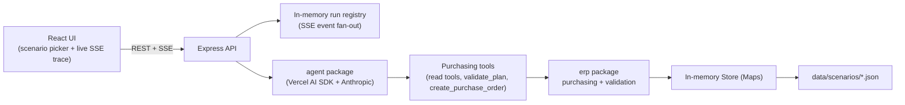

# AI Purchasing Agent

A full-stack AI agent that reviews a purchasing recommendation, investigates the
relevant ERP data with tools, decides whether to accept / modify / reject / investigate
further, acts by creating a purchase order, and then re-reads reality to validate what
actually happened — closing the feedback loop the assignment asks for.

Built for the Rappi AI Purchasing Agent take-home assignment (see [Assignment.pdf](Assignment.pdf)).

## Contents

- [Approach](#approach)
- [Architecture](#architecture)
- [Repo layout](#repo-layout)
- [Setup & run](#setup--run)
- [Scenario](#scenario)
- [How decisions are validated](#how-decisions-are-validated)
- [Evaluation](#evaluation)
- [What's not implemented](#whats-not-implemented)

## Approach

The core bet of this solution: **the differentiator is not the LLM's answer, it's the
machinery around it.**

- The **LLM** is an investigator and planner. It reads ERP data through tools, forms a
  plan, and can create a purchase order.
- A **deterministic validation engine** (no LLM involved) checks any proposed plan
  against MOQ, case-pack, storage capacity, budget, demand coverage, overbuy risk,
  lead-time feasibility, and supplier allocation. The same rules run before the agent
  acts (pre-flight, on requested quantity) and after it acts (post-execution, on
  confirmed quantity).
- The **mock ERP** is ground truth, and it deliberately does not always give the agent
  what it asked for: a supplier can only fill part of an order (allocation cap), round
  down to a case-pack multiple, or refuse a quantity that falls below MOQ. This means
  `confirmedQty != requestedQty` happens for real, not as a scripted twist — so the
  agent has something genuine to reconcile against after acting.
- The system prompt requires the agent to re-run validation against what the supplier
  actually confirmed, not against what it originally requested, and to react (adjust,
  escalate, or stop) if the outcome diverged from its intent.

This directly targets the assignment's "Feedback and Validation" requirement: the
agent doesn't just claim success, it re-reads the actual resulting state and checks it
against the same deterministic rules that gated the original decision.

## Architecture



Three independent packages, each with a single responsibility:

| Package | Responsibility |
|---|---|
| [`erp/`](erp/) | Mock ERP: typed domain model, an in-memory `Store` seeded from scenario JSON, purchasing logic (the supplier-confirmation feedback loop), and the deterministic validation engine. No LLM, no HTTP — pure functions, unit tested. |
| [`agent/`](agent/) | The agent loop: a Vercel AI SDK tool-calling loop (`runAgent`) against Anthropic, a purchasing system prompt, and the tool layer (`createPurchasingTools`) that binds read/validate/act tools to one `Store` instance for a single run. |
| [`api/`](api/) | Express server. Starts a run, streams its progress as Server-Sent Events, and exposes scenario data for the frontend. Holds no domain logic of its own — it wires `erp` and `agent` together and manages run/event state. |
| [`frontend/`](frontend/) | Vite + React console: pick a scenario, launch a run, watch tool calls/results and the agent's final decision arrive live over SSE. |

Data flow for one run:

1. Frontend calls `POST /api/runs { scenarioId }`.
2. The API loads the scenario JSON into a **fresh `Store` clone** (each run gets its own
   isolated ERP state — concurrent runs never share mutated inventory) and starts the
   agent loop in the background, returning a `runId` immediately.
3. The frontend opens `GET /api/runs/:id/events` (SSE) and renders `tool_call`,
   `tool_result`, `assistant_message`, `done`, and `error` events as they happen.
4. Inside the agent loop, the model calls read tools (`get_inventory`,
   `get_demand_forecast`, `list_open_purchase_orders`, `list_suppliers`, `get_budget`,
   …), calls `validate_plan` before acting, calls `create_purchase_order` to act, then
   calls `validate_plan` again on what the supplier actually confirmed.

## Repo layout

```text
erp/         domain types, InMemoryStore, purchasing (feedback loop), validation engine
agent/       runAgent tool loop, purchasing tools, system prompt
api/         Express app, run registry + SSE, scenario routes
frontend/    Vite + React console
data/        scenarios/*.json — seed data for the mock ERP
Assignment.pdf
```

## Setup & run

Requires Node >= 24 and Yarn 1 (Yarn 1 copies `file:../agent` / `file:../erp` into
each consumer's `node_modules`, so `erp` and `agent` must be built before `api` is
installed/rebuilt against them).

```bash
# 1. erp package — build first, everything else depends on it
cd erp && yarn install && yarn build

# 2. agent package — depends on erp
cd ../agent && yarn install && yarn build
cp .env.example .env   # fill in ANTHROPIC_API_KEY

# 3. api — depends on erp + agent
cd ../api && yarn install
cp .env.example .env   # fill in ANTHROPIC_API_KEY (or reuse agent's)
yarn dev                # http://localhost:3001

# 4. frontend
cd ../frontend && yarn install
yarn dev                # http://localhost:5173
```

If you change `erp` or `agent` after the initial install, rebuild that package
(`yarn build`) and reinstall the consumer (`yarn install --force` in `api/`) so the
copied `file:` dependency picks up the change.

Environment variables (see each package's `.env.example`):

| Variable | Where | Purpose |
|---|---|---|
| `ANTHROPIC_API_KEY` | `agent/`, `api/` | Anthropic API key used by the Vercel AI SDK |
| `ANTHROPIC_MODEL` | `agent/`, `api/` | Model id override (optional) |
| `PORT` | `api/` | API port, defaults to `3001` |
| `SCENARIOS_DIR` | `agent/`, `api/` | Override scenario JSON location (optional; defaults to `data/scenarios`) |

No secrets are committed — `.env` is gitignored in every package; only `.env.example`
is tracked.

### Running without the UI

```bash
cd agent && yarn smoke:scenario   # runs s1-recommendation-review end-to-end in the terminal
```

### Tests

```bash
cd erp && yarn test      # purchasing + validation unit tests (no API key needed)
cd agent && yarn test    # tool-level tests against a real Store (no API key needed)
```

## Scenario

**S1 — Purchase Recommendation Review** ([data/scenarios/s1-recommendation-review.json](data/scenarios/s1-recommendation-review.json)),
implemented end-to-end, is the assignment's Scenario 1 and its required minimum ("at
least one scenario must be implemented end-to-end"):

- System recommends buying **800 units** of `P-COKE-500` at `FC-BLR-01`.
- On hand 120 (10 reserved, 50 safety stock), 14-day forecast 600 units, one open PO
  already bringing in 400 confirmed units, node has 480/1000 storage units used,
  primary supplier MOQ 96 / case pack 24 / lead time 5 days, budget ₹50,000 with
  ₹8,800 already committed.
- Naively executing the 800-unit recommendation would blow through storage capacity
  once the incoming 400 units are counted — the validation engine catches this
  (`STORAGE_CAPACITY` fails at 800, so `autoApprove` is `false`) and the agent's system
  prompt is instructed to treat that as a reason to modify or investigate rather than
  execute blindly.
- The scenario also seeds a case-pack/MOQ divergence path: any requested quantity that
  isn't a multiple of 24, or falls under supplier allocation, causes
  `confirmedQty != requestedQty` in `create_purchase_order`, exercising the
  feedback loop described above (see the `erp` unit tests and
  `agent/src/__tests__/purchasing-tools.test.ts` for a worked example).

Scenarios 2–4 from the assignment (supplier shortfall, demand spike, hard constraint)
are not implemented with their own seed data. The assignment explicitly scopes this as
optional ("You are not expected to implement all four scenarios... breadth is less
important than the quality of the core solution") — see
[What's not implemented](#whats-not-implemented) for what a Scenario 2 extension would
need, since the underlying mechanics (partial supplier confirmation) already exist in
`erp/src/purchasing.ts`.

## How decisions are validated

`erp/src/validate.ts` runs the same deterministic checks in both directions:

| Rule | What it checks |
|---|---|
| `MOQ_SATISFIED` | Quantity meets the supplier's minimum order quantity |
| `CASE_PACK_MULTIPLE` | Quantity is a whole multiple of the product's case pack |
| `STORAGE_CAPACITY` | Node has room once this order and already-incoming stock land |
| `BUDGET_AVAILABLE` | Order cost fits in what's left of the current budget period |
| `DEMAND_COVERAGE` | Projected stock covers the demand forecast horizon |
| `NO_OVERBUY` | Projected stock doesn't exceed 1.5x the forecast (warn, not fail) |
| `LEAD_TIME_FEASIBLE` | Existing + incoming stock lasts past the supplier's lead time (warn) |
| `SUPPLIER_CAN_FULFIL` | Quantity doesn't exceed the supplier's available allocation |

Each rule returns `{ id, status: pass | fail | warn, expected, actual, message }`, and
`decideApproval()` reduces that list to a single `autoApprove` boolean: any `fail`
blocks approval, any `warn` also routes to review, and only an all-pass result
auto-approves. None of this touches the LLM — `validate_plan` is a plain function the
agent calls as a tool, and the same function is what the unit tests exercise directly.

**Pre-flight vs. post-execution** is the actual feedback loop: the agent is instructed
to call `validate_plan` with its intended quantity before acting, then call
`create_purchase_order`, then call `validate_plan` again — this time with `quantity: 0`
(the new PO is already reflected in "incoming" stock, so re-passing `confirmedQty`
would double count it) — so the second validation pass is checking the *actual*
resulting world state, not the agent's stated intent. If the supplier only confirmed
part of the order, that's visible in `diverged: true` on the `create_purchase_order`
result, and the prompt requires the agent to react to it (top up, accept, or flag for a
human) rather than report success regardless.

## Evaluation

The assignment asks for a small set of test scenarios and an explanation of how
agent decisions are judged, evaluated against six questions. Mapping those onto what
exists in this repo:

| Question | How it's answered here |
|---|---|
| Was the decision correct? | `agent/src/__tests__/purchasing-tools.test.ts` and the `erp` unit tests assert the *deterministic* half (validation results, confirmed quantities) against hand-computed expected values from the S1 seed data — the parts that must be correct regardless of what the LLM decides. The LLM's final decision is inspected via `yarn smoke:scenario` / the UI trace against the same numbers. |
| Did the agent obtain the necessary information? | The run trace (SSE events / smoke script output) shows every tool call the agent made before deciding; the system prompt requires investigation before deciding, and S1 is seeded so that skipping any one input (open PO, storage, MOQ) leads to an unsafe accept. |
| Did it respect relevant constraints? | Checked mechanically, not by re-reading the model's prose: `validate_plan`'s results are logged as tool results in the run trace, so a reviewer can confirm the agent actually called it and see which rules passed/failed at the quantity it chose. |
| Did it take the appropriate action? | `create_purchase_order`'s result (`po`, `adjustments`, `diverged`) is logged in the trace and asserted in the `erp`/`agent` unit tests for the scripted case-pack/MOQ divergence path. |
| Did it validate the result? | Enforced by the prompt's required second `validate_plan` call post-execution (see above); visible in the trace as a second `validate_plan` tool call with `quantity: 0` after `create_purchase_order`. |
| What happens when the initial action doesn't work? | `createPurchaseOrder` never throws on a supplier shortfall — it returns `PARTIALLY_CONFIRMED` with an `adjustments` explanation, and the prompt requires the agent to treat that as a real constraint to react to (accept the partial fill, look elsewhere, or say a human should decide) rather than silently reporting the original request as fulfilled. |

Deliberately **not** built: a scoring harness with an aggregate pass rate across many
LLM calls. At this scope, a run trace a human can read end-to-end (what was read, what
was decided, what was validated, what happened after) is more informative than a
numeric score over a handful of scenarios, and it's what's checked in via the unit
tests plus the smoke script / UI trace above.

## What's not implemented

Scoped out under the assignment's explicit time budget (6–8 hours) and its own
guidance that breadth matters less than the quality of the core loop:

- **Scenarios 2–4** have no seed JSON. `erp/src/purchasing.ts` already produces
  `PARTIALLY_CONFIRMED` orders (the mechanic Scenario 2 is built around), so adding a
  second scenario is mostly a new `data/scenarios/*.json` file plus a prompt nudge —
  not new engine code.
- **No enforced approval gate.** `validate_plan`'s `autoApprove` result and the system
  prompt's instruction to stop when it's `false` are advisory, not enforced — the
  agent (or a buyer's follow-up instruction) can still call `create_purchase_order`
  directly. A stricter version would have the API refuse to execute a plan that failed
  validation unless a human explicitly approved it first.
- **No escalate-to-human tool or UI approval step.** The frontend shows the run
  happening and the final decision, but there's no pause point for a buyer to approve,
  reject, or redirect a plan mid-run.
- **No persistence.** Runs and their event history live in an in-memory registry; they
  don't survive an API restart. Fine for a demo, not for production.
