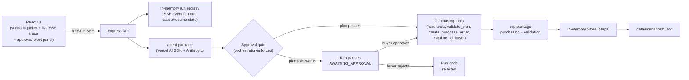

# AI Purchasing Agent

A full-stack AI agent that reviews a purchasing recommendation, investigates the
relevant ERP data with tools, decides whether to accept / modify / reject / investigate
further, acts by creating a purchase order, and then re-reads reality to validate what
actually happened — closing the feedback loop the assignment asks for.

Built for the Rappi AI Purchasing Agent take-home assignment (see [Assignment.pdf](Assignment.pdf)).

## Contents

- [Approach](#approach)
- [Architecture](#architecture)
- [Repo layout](#repo-layout)
- [Setup & run](#setup--run)
- [Scenarios](#scenarios)
- [How decisions are validated](#how-decisions-are-validated)
- [Human approval gate and escalation](#human-approval-gate-and-escalation)
- [Evaluation](#evaluation)
- [What's not implemented](#whats-not-implemented)

## Approach

The core bet of this solution: **the differentiator is not the LLM's answer, it's the
machinery around it.**

- The **LLM** is an investigator and planner. It reads ERP data through tools, forms a
  plan, and can create a purchase order.
- A **deterministic validation engine** (no LLM involved) checks any proposed plan
  against MOQ, case-pack, storage capacity, budget, demand coverage, overbuy risk,
  lead-time feasibility, and supplier allocation. The same rules run before the agent
  acts (pre-flight, on requested quantity) and after it acts (post-execution, on
  confirmed quantity).
- The **mock ERP** is ground truth, and it deliberately does not always give the agent
  what it asked for: a supplier can only fill part of an order (allocation cap), round
  down to a case-pack multiple, or refuse a quantity that falls below MOQ. This means
  `confirmedQty != requestedQty` happens for real, not as a scripted twist — so the
  agent has something genuine to reconcile against after acting.
- The system prompt requires the agent to re-run validation against what the supplier
  actually confirmed, not against what it originally requested, and to react (adjust,
  escalate, or stop) if the outcome diverged from its intent.
- The model can *propose* `create_purchase_order`, but it cannot make it execute.
  An orchestrator-owned gate re-validates the exact plan being submitted and only lets
  it through when every rule passes; anything else pauses the whole run for a human
  buyer to approve or reject, independent of what the model believes or was told. See
  [Human approval gate and escalation](#human-approval-gate-and-escalation).

This directly targets the assignment's "Feedback and Validation" requirement: the
agent doesn't just claim success, it re-reads the actual resulting state and checks it
against the same deterministic rules that gated the original decision — and a write
that fails that gate never reaches the mock ERP without a human saying so.

## Architecture



Three independent packages, each with a single responsibility:

| Package | Responsibility |
|---|---|
| [`erp/`](erp/) | Mock ERP: typed domain model, an in-memory `Store` seeded from scenario JSON, purchasing logic (the supplier-confirmation feedback loop), and the deterministic validation engine. No LLM, no HTTP — pure functions, unit tested. |
| [`agent/`](agent/) | The agent loop: a Vercel AI SDK tool-calling loop (`runAgent`) against Anthropic, a purchasing system prompt, the tool layer (`createPurchasingTools`), and the approval gate (`createApprovalGate`) that decides whether `create_purchase_order` is allowed to execute. |
| [`api/`](api/) | Express server. Starts a run, streams its progress as Server-Sent Events, exposes scenario data, and applies a buyer's approve/reject decision to a paused run. Holds no domain logic of its own — it wires `erp` and `agent` together and manages run/event state. |
| [`frontend/`](frontend/) | Vite + React console: pick a scenario, launch a run, watch tool calls/results stream live, and approve or reject a plan the gate has paused. |

Data flow for one run:

1. Frontend calls `POST /api/runs { scenarioId }`.
2. The API loads the scenario JSON into a **fresh `Store` clone** (each run gets its own
   isolated ERP state — concurrent runs never share mutated inventory) and starts the
   agent loop in the background, returning a `runId` immediately.
3. The frontend opens `GET /api/runs/:id/events` (SSE) and renders `tool_call`,
   `tool_result`, `assistant_message`, `approval_requested`, `approval_decided`,
   `escalation`, `done`, and `error` events as they happen.
4. Inside the agent loop, the model calls read tools (`get_inventory`,
   `get_demand_forecast`, `list_open_purchase_orders`, `list_suppliers`, `get_budget`,
   …), calls `validate_plan` before acting, then calls `create_purchase_order` to act.
   That call only actually runs if the approval gate independently re-validates the
   same plan and it passes cleanly (see below) — otherwise the run pauses. After a
   successful write, the model calls `validate_plan` again on what the supplier
   actually confirmed.
5. If the run paused, the frontend shows the blocked plan and posts the buyer's
   decision to `POST /api/runs/:id/decision`. Approving resumes the *same* model
   conversation with the decision fed back in — the model then either executes and
   reports the real outcome, or reacts further (e.g. escalates) if the human-approved
   write introduced its own problem. Reconnecting to `GET /api/runs/:id/events` shows
   the resumed run continuing live.

## Repo layout

```text
erp/         domain types, InMemoryStore, purchasing (feedback loop), validation engine
agent/       runAgent tool loop, purchasing tools, system prompt
api/         Express app, run registry + SSE, scenario routes
frontend/    Vite + React console
data/        scenarios/*.json — seed data for the mock ERP
Assignment.pdf
```

## Setup & run

Requires Node >= 24 and Yarn 1 (Yarn 1 copies `file:../agent` / `file:../erp` into
each consumer's `node_modules`, so `erp` and `agent` must be built before `api` is
installed/rebuilt against them).

```bash
# 1. erp package — build first, everything else depends on it
cd erp && yarn install && yarn build

# 2. agent package — depends on erp
cd ../agent && yarn install && yarn build
cp .env.example .env   # fill in ANTHROPIC_API_KEY

# 3. api — depends on erp + agent
cd ../api && yarn install
cp .env.example .env   # fill in ANTHROPIC_API_KEY (or reuse agent's)
yarn dev                # http://localhost:3001

# 4. frontend
cd ../frontend && yarn install
yarn dev                # http://localhost:5173
```

If you change `erp` or `agent` after the initial install, rebuild that package
(`yarn build`) and reinstall the consumer (`yarn install --force` in `api/`) so the
copied `file:` dependency picks up the change.

Environment variables (see each package's `.env.example`):

| Variable | Where | Purpose |
|---|---|---|
| `ANTHROPIC_API_KEY` | `agent/`, `api/` | Anthropic API key used by the Vercel AI SDK |
| `ANTHROPIC_MODEL` | `agent/`, `api/` | Model id override (optional) |
| `PORT` | `api/` | API port, defaults to `3001` |
| `SCENARIOS_DIR` | `agent/`, `api/` | Override scenario JSON location (optional; defaults to `data/scenarios`) |

No secrets are committed — `.env` is gitignored in every package; only `.env.example`
is tracked.

### Running without the UI

```bash
cd agent && yarn smoke:scenario                                          # s1, end-to-end
cd agent && yarn smoke:scenario s2-supplier-shortfall                    # s2, end-to-end
cd agent && yarn smoke:scenario s2-supplier-shortfall --force-pause --approve  # force the approval gate to pause, then approve
cd agent && yarn smoke:scenario s2-supplier-shortfall --force-pause --reject   # same, then reject
```

`--force-pause` overrides the buyer prompt to instruct the agent to submit a plan
that's known to fail validation (S2's 250-unit top-up busts the remaining budget). The
well-behaved system prompt means the agent rarely proposes a bad plan on its own — this
flag exists so the pause-and-resume path can be exercised on demand rather than by
chance. `--approve`/`--reject` then drive the resume.

### Tests

```bash
cd erp && yarn test      # purchasing + validation unit tests (no API key needed)
cd agent && yarn test    # tool-level tests against a real Store (no API key needed)
```

## Scenarios

The assignment requires at least one scenario end-to-end and says breadth matters less
than the quality of the core solution. Two are implemented; S3/S4 are not (see
[What's not implemented](#whats-not-implemented)).

### S1 — Purchase Recommendation Review

[data/scenarios/s1-recommendation-review.json](data/scenarios/s1-recommendation-review.json) —
the assignment's Scenario 1 and the required minimum:

- System recommends buying **800 units** of `P-COKE-500` at `FC-BLR-01`.
- On hand 120 (10 reserved, 50 safety stock), 14-day forecast 600 units, one open PO
  already bringing in 400 confirmed units, node has 480/1000 storage units used,
  primary supplier MOQ 96 / case pack 24 / lead time 5 days, budget ₹50,000 with
  ₹8,800 already committed.
- Naively executing the 800-unit recommendation would blow through storage capacity
  once the incoming 400 units are counted — the validation engine catches this
  (`STORAGE_CAPACITY` fails at 800, so `autoApprove` is `false`), and the approval gate
  means that recommendation literally cannot execute without a human overriding it.
- The scenario also seeds a case-pack/MOQ divergence path: any requested quantity that
  isn't a multiple of 24, or falls under supplier allocation, causes
  `confirmedQty != requestedQty` in `create_purchase_order`, exercising the
  feedback loop described above (see the `erp` unit tests and
  `agent/src/__tests__/purchasing-tools.test.ts` for a worked example).

### S2 — Supplier Cannot Fulfil the Purchase

[data/scenarios/s2-supplier-shortfall.json](data/scenarios/s2-supplier-shortfall.json) —
the assignment's Scenario 2, and the scenario that exercises the human-approval gate:

- PO-9001 requested **500 units** of `P-RICE-5KG`; the supplier's allocation cap means
  only **250** confirmed (`PARTIALLY_CONFIRMED`).
- Covering the remaining 250-unit gap from the only alternate supplier
  (`SUP-GRAIN-02`, ₹610/unit vs. the original ₹420/unit) costs ₹152,500 against only
  ₹45,000 of remaining budget — `BUDGET_AVAILABLE` fails hard on the obvious "just
  cover the shortfall" plan, so the gate pauses any attempt to execute it as-is.
- A smaller, budget-safe top-up (60–70 units from the same alternate supplier) passes
  every rule cleanly and covers the 14-day forecast — the agent typically finds this
  on its own by trying `validate_plan` at a few quantities before ever attempting
  `create_purchase_order`, which is why it rarely needs to escalate or wait on the
  gate in practice (see `--force-pause` above to exercise the gate on demand).
- This scenario is what proves the pause → human decision → resume path end-to-end,
  not just the "gate blocks a bad tool call" half.

## How decisions are validated

`erp/src/validate.ts` runs the same deterministic checks in both directions:

| Rule | What it checks |
|---|---|
| `MOQ_SATISFIED` | Quantity meets the supplier's minimum order quantity |
| `CASE_PACK_MULTIPLE` | Quantity is a whole multiple of the product's case pack |
| `STORAGE_CAPACITY` | Node has room once this order and already-incoming stock land |
| `BUDGET_AVAILABLE` | Order cost fits in what's left of the current budget period |
| `DEMAND_COVERAGE` | Projected stock covers the demand forecast horizon |
| `NO_OVERBUY` | Projected stock doesn't exceed 1.5x the forecast (warn, not fail) |
| `LEAD_TIME_FEASIBLE` | Existing + incoming stock lasts past the supplier's lead time (warn) |
| `SUPPLIER_CAN_FULFIL` | Quantity doesn't exceed the supplier's available allocation |

Each rule returns `{ id, status: pass | fail | warn, expected, actual, message }`, and
`decideApproval()` reduces that list to a single `autoApprove` boolean: any `fail`
blocks approval, any `warn` also routes to review, and only an all-pass result
auto-approves. None of this touches the LLM — `validate_plan` is a plain function the
agent calls as a tool, and the same function is what the unit tests exercise directly.

**Pre-flight vs. post-execution** is the actual feedback loop: the agent is instructed
to call `validate_plan` with its intended quantity before acting, then call
`create_purchase_order`, then call `validate_plan` again — this time with `quantity: 0`
(the new PO is already reflected in "incoming" stock, so re-passing `confirmedQty`
would double count it) — so the second validation pass is checking the *actual*
resulting world state, not the agent's stated intent. If the supplier only confirmed
part of the order, that's visible in `diverged: true` on the `create_purchase_order`
result, and the prompt requires the agent to react to it (top up, accept, or flag for a
human) rather than report success regardless.

## Human approval gate and escalation

The assignment repeatedly asks when human approval is appropriate and warns against
blindly executing a recommendation. Two distinct mechanisms answer that here — one
enforced by the system, one chosen by the agent:

**The approval gate (enforced, not advisory).** `create_purchase_order` is registered
with the Vercel AI SDK's `toolApproval` mechanism
([agent/src/tools/purchasing-tools.ts](agent/src/tools/purchasing-tools.ts):`createApprovalGate`).
Before every call to that tool, the gate independently re-runs `validatePlan` /
`decideApproval` on the exact plan being submitted — the same deterministic engine
described above, called by the orchestrator, not the model. If it doesn't pass cleanly,
the SDK's tool loop halts mid-run with a `tool-approval-request`; the tool never
executes. The API surfaces this as an `awaiting_approval` run status and an
`approval_requested` SSE event carrying the blocked plan and the reason it failed. A
buyer approves or rejects via `POST /api/runs/:id/decision`:

- **Approve** resumes the *same* model conversation (the exact prior message history,
  replayed via the SDK's own resume contract) with the human's decision fed back in as
  a tool-approval-response. The model then sees the write actually happen and continues
  from there — including reacting if the human-approved plan itself turns out to have
  a downstream consequence (see the [S2 walkthrough](#s2--supplier-cannot-fulfil-the-purchase) above).
- **Reject** ends the run without ever calling `createPurchaseOrder` — there is nothing
  to undo, because the gate never let the write reach the store.

This means the model's own confidence, or a buyer's free-text instruction to "just do
it," cannot bypass validation — only an explicit approval decision through the gate can.

**Escalation (the agent's own judgment call).** Separately, `escalate_to_buyer`
(same file) is a plain terminal tool the model can call itself when a situation calls
for human judgment it doesn't have — conflicting evidence, a shortfall with no clearly
correct alternative, a constraint violation with no safe fallback. This is different
from the gate: escalation is the agent deciding a human should take over the *decision*,
not a plan that merely failed a specific rule. It ends the run with an `escalated`
status and an `escalation` SSE event carrying the agent's reasoning and the context a
buyer needs to pick up from there.

Both were verified against a live model, not just unit-tested in isolation — see
`yarn smoke:scenario s2-supplier-shortfall --force-pause --approve` /
`--reject` above, and `agent/src/__tests__/approval-gate.test.ts` for the deterministic
half (the gate's pass/fail routing) run without a live model call.

## Evaluation

The assignment asks for a small set of test scenarios and an explanation of how
agent decisions are judged, evaluated against six questions. Mapping those onto what
exists in this repo:

| Question | How it's answered here |
|---|---|
| Was the decision correct? | `agent/src/__tests__/purchasing-tools.test.ts` and the `erp` unit tests assert the *deterministic* half (validation results, confirmed quantities) against hand-computed expected values from the S1 seed data — the parts that must be correct regardless of what the LLM decides. The LLM's final decision is inspected via `yarn smoke:scenario` / the UI trace against the same numbers. |
| Did the agent obtain the necessary information? | The run trace (SSE events / smoke script output) shows every tool call the agent made before deciding; the system prompt requires investigation before deciding, and S1 is seeded so that skipping any one input (open PO, storage, MOQ) leads to an unsafe accept. |
| Did it respect relevant constraints? | Checked mechanically, not by re-reading the model's prose: `validate_plan`'s results are logged as tool results in the run trace, so a reviewer can confirm the agent actually called it and see which rules passed/failed at the quantity it chose. |
| Did it take the appropriate action? | `create_purchase_order`'s result (`po`, `adjustments`, `diverged`) is logged in the trace and asserted in the `erp`/`agent` unit tests for the scripted case-pack/MOQ divergence path. |
| Did it validate the result? | Enforced by the prompt's required second `validate_plan` call post-execution (see above); visible in the trace as a second `validate_plan` tool call with `quantity: 0` after `create_purchase_order`. |
| What happens when the initial action doesn't work? | `createPurchaseOrder` never throws on a supplier shortfall — it returns `PARTIALLY_CONFIRMED` with an `adjustments` explanation, and the prompt requires the agent to treat that as a real constraint to react to (accept the partial fill, look elsewhere, or say a human should decide) rather than silently reporting the original request as fulfilled. Separately, when a plan fails validation outright, it never reaches the store at all — the [approval gate](#human-approval-gate-and-escalation) blocks it and a human decides, verified live via `--force-pause --approve`/`--reject`. |

Deliberately **not** built: a scoring harness with an aggregate pass rate across many
LLM calls. At this scope, a run trace a human can read end-to-end (what was read, what
was decided, what was validated, what happened after) is more informative than a
numeric score over a handful of scenarios, and it's what's checked in via the unit
tests plus the smoke script / UI trace above.

## What's not implemented

Scoped out under the assignment's explicit time budget (6–8 hours) and its own
guidance that breadth matters less than the quality of the core loop:

- **Scenarios 3–4** (demand spike, hard constraint) have no seed JSON. Both are
  variations on mechanics already built — S3 would mostly need a sales-actuals-vs-
  forecast gap plus a nudge for the agent to seek more evidence; S4 is close to S2's
  budget-constraint shape with a different binding constraint.
- **No persistence.** Runs and their event history live in an in-memory registry; they
  don't survive an API restart. Fine for a demo, not for production.
- **A rejected plan doesn't hand fresh guidance back to the model.** `submitDecision`'s
  optional `reason` on rejection is recorded in the trace but isn't fed into the
  resumed conversation as an instruction — the model sees "denied" but not *why* beyond
  what the gate itself reported. A buyer's free-text redirection (e.g. "use the other
  supplier instead") would currently need to come from a fresh run rather than steering
  the same one.
- **No cancel/modify tools for existing purchase orders.** The agent can create new POs
  but has no way to cancel or amend one it already placed — relevant if a human rejects
  a plan after a *related* PO already went through in the same run (as in the S2 case
  where the top-up is human-approved on top of the already-existing PO-9001).
