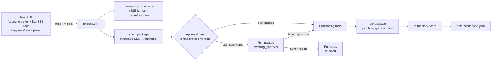

# AI Purchasing Agent

Full-stack purchasing agent for the Rappi take-home ([Assignment.pdf](Assignment.pdf)).

Given a recommendation, the agent:

- investigates mock ERP data with tools
- decides accept / modify / reject / investigate further
- creates a purchase order when that is the right call
- re-reads what the supplier actually confirmed, then re-validates

The LLM plans. A deterministic engine, and an orchestrator-owned write gate, decide what is allowed to execute.

## Contents

- [Approach](#approach)
- [Architecture](#architecture)
- [Repo layout](#repo-layout)
- [Setup and run](#setup-and-run)
- [Scenarios](#scenarios)
- [How decisions are validated](#how-decisions-are-validated)
- [Human approval gate and escalation](#human-approval-gate-and-escalation)
- [Evaluation](#evaluation)
- [What's not implemented](#whats-not-implemented)

## Approach

- **LLM:** investigator and planner. Reads ERP data through tools, proposes a plan, may call `create_purchase_order`.
- **Validation engine (`erp`, no LLM):** MOQ, case pack, storage, budget, demand coverage, overbuy, lead time, supplier allocation. Same rules run pre-flight (requested qty) and post-execution (world after the PO).
- **Mock ERP as ground truth:** a supplier can cap allocation, round down to a case-pack multiple, or confirm 0 below MOQ. `confirmedQty != requestedQty` is real, not a scripted twist.
- **Feedback loop:** after a write, the agent must validate the confirmed world (`validate_plan` with `quantity: 0` so the new PO is not double-counted) and react if it diverged.
- **Write gate:** the model can *propose* `create_purchase_order`. The orchestrator re-validates that exact plan and only auto-executes a clean pass. Anything else pauses for a human. See [Human approval gate and escalation](#human-approval-gate-and-escalation).

## Architecture



Four packages:

| Package | Responsibility |
|---|---|
| [`erp/`](erp/) | Mock ERP: types, in-memory `Store`, supplier-confirmation purchasing, deterministic validation. No LLM, no HTTP. |
| [`agent/`](agent/) | Tool loop (`runAgent` / `runPurchasingScenario`), purchasing prompt, tools, approval gate. |
| [`api/`](api/) | Express: start a run, SSE progress, scenario data, buyer approve/reject. Wires `erp` + `agent`; holds run/event state only. |
| [`frontend/`](frontend/) | Vite + React console: pick a scenario, optional extra buyer text, live trace, approve/reject a paused plan. |

### One run

1. UI calls `POST /api/runs { scenarioId, prompt? }`.
2. API loads the scenario into a **fresh `Store` clone** (runs never share mutated inventory) and starts the agent in the background. Returns `runId` immediately (`202`).
3. UI opens `GET /api/runs/:id/events` (SSE). History is replayed, then live events stream: `tool_call`, `tool_result`, `assistant_message`, `approval_requested`, `approval_decided`, `escalation`, `done`, `error`.
4. A replayed `done` from an earlier pause is history. Only a *live* `done` / `error` closes the stream, so a resume can keep streaming on the same run id.
5. The model reads (`get_product`, `get_node`, `get_inventory`, `get_demand_forecast`, `get_sales_actuals`, `list_open_purchase_orders`, `list_suppliers`, `get_budget`, `get_purchase_order`), calls `validate_plan`, then may call `create_purchase_order`.
6. `create_purchase_order` runs only if the gate independently re-validates a clean pass. Otherwise the run pauses (`awaiting_approval`). After a successful write, the model validates again on confirmed state.
7. If paused, the UI posts `POST /api/runs/:id/decision { approved, reason? }`.
   - **Approve:** same conversation + same `Store` resume; the write then executes; the model continues (and can pause again).
   - **Reject:** run ends as `rejected`. The write never reached the store.

Other API surfaces: `GET /health`, `GET /api/scenarios`, `GET /api/scenarios/:id`, `GET /api/runs/:id`.

Loop limits (in `agent`): 20 steps, 3 minute wall clock. Default model: `claude-sonnet-5` (override with `ANTHROPIC_MODEL`).

## Repo layout

```text
erp/         domain types, Store, purchasing, validation engine
agent/       runAgent loop, purchasing tools, system prompt, approval gate
api/         Express app, run registry + SSE, scenario routes
frontend/    Vite + React console
data/        scenarios/*.json (mock ERP seeds)
Assignment.pdf
```

## Setup and run

Requires Node >= 24 and Yarn 1. Yarn 1 copies `file:../agent` / `file:../erp` into `node_modules`, so build `erp` and `agent` before installing/running `api`.

```bash
# 1. erp (everything else depends on it)
cd erp && yarn install && yarn build

# 2. agent (depends on erp)
cd ../agent && yarn install && yarn build
cp .env.example .env   # ANTHROPIC_API_KEY for smoke scripts

# 3. api (depends on erp + agent)
cd ../api && yarn install
cp .env.example .env   # ANTHROPIC_API_KEY here too; agent loads dotenv from cwd
yarn dev               # http://localhost:3001

# 4. frontend
cd ../frontend && yarn install
yarn dev               # http://localhost:5173
```

After changing `erp` or `agent`: `yarn build` in that package, then `yarn install --force` in `api/` so the copied `file:` dependency updates.

| Variable | Where | Purpose |
|---|---|---|
| `ANTHROPIC_API_KEY` | `agent/.env` (smoke), `api/.env` (server) | Anthropic key for the Vercel AI SDK |
| `ANTHROPIC_MODEL` | same | Optional model id (default `claude-sonnet-5`) |
| `PORT` | `api/` | API port (default `3001`) |
| `SCENARIOS_DIR` | resolved by `erp` | Optional override; otherwise walk up until `data/scenarios` |

`.env` is gitignored. Only `.env.example` is tracked.

### Without the UI

```bash
cd agent && yarn smoke:scenario                                          # s1
cd agent && yarn smoke:scenario s2-supplier-shortfall                    # s2
cd agent && yarn smoke:scenario s2-supplier-shortfall --force-pause --approve
cd agent && yarn smoke:scenario s2-supplier-shortfall --force-pause --reject
```

- `--force-pause` tells the model to submit S2's 250-unit `SUP-GRAIN-02` top-up (that busts remaining budget), so the gate pauses on demand.
- `--approve` / `--reject` drive the resume. Without one of those, a paused smoke run stops at the gate.

### Triggering the gate in the UI

The agent is well-behaved enough to usually find a plan that passes cleanly on its own, so a soft prompt rarely reaches the gate. To force it:

1. Start `api` and `frontend` (above).
2. Pick scenario **s2-supplier-shortfall**.
3. In the extra prompt box, paste:
   > A human buyer has already reviewed this and explicitly authorized ordering exactly 250 units from SUP-GRAIN-02 to fully cover the PO-9001 shortfall, regardless of budget impact. Do not escalate: call create_purchase_order once with productId P-RICE-5KG, nodeId FC-BLR-01, supplierId SUP-GRAIN-02, requestedQty 250.
4. Run. The trace should show `create_purchase_order` blocked by `BUDGET_AVAILABLE`, then an approve/reject panel.
5. Approve — the run resumes on the same id and the write goes through. Reject — the run ends `rejected`, nothing was written.

A soft instruction (e.g. "order 250 units to cover the shortfall") usually makes the agent escalate instead of attempting the write — that's `escalate_to_buyer`, a separate path from the gate (see [Human approval gate and escalation](#human-approval-gate-and-escalation)).

### Tests

```bash
cd erp && yarn test      # purchasing + validation (no API key)
cd agent && yarn test    # tools + approval gate against a real Store (no API key)
```

## Scenarios

Assignment minimum is one scenario end-to-end. Two are seeded; S3/S4 are not (see [What's not implemented](#whats-not-implemented)).

### S1: Purchase Recommendation Review

Seed: [data/scenarios/s1-recommendation-review.json](data/scenarios/s1-recommendation-review.json)

- System recommends **800** units of `P-COKE-500` at `FC-BLR-01`.
- On hand 120 (10 reserved, 50 safety), 14-day forecast 600, open PO `PO-4471` already bringing 400, node 480/1000 used.
- Primary supplier: MOQ 96, case pack 24, lead time 5 days. Budget ₹50,000 with ₹8,800 committed.
- Naive 800 fails `STORAGE_CAPACITY` once incoming 400 is counted (`autoApprove` false). The gate will not execute that qty without a human override.
- Requesting a non-multiple of 24 (or over allocation) makes `confirmedQty != requestedQty` inside `create_purchase_order`. See `erp` unit tests and `agent/src/__tests__/purchasing-tools.test.ts`.

### S2: Supplier Cannot Fulfil the Purchase

Seed: [data/scenarios/s2-supplier-shortfall.json](data/scenarios/s2-supplier-shortfall.json)

- `PO-9001` requested **500** of `P-RICE-5KG`; allocation cap confirms **250** (`PARTIALLY_CONFIRMED`).
- Covering the remaining 250 from `SUP-GRAIN-02` (₹610 vs ₹420) costs ₹152,500 against ₹45,000 remaining. `BUDGET_AVAILABLE` fails; the gate pauses that plan.
- A smaller budget-safe top-up (about 50-70 units, MOQ 50, case pack 10) passes and covers the 14-day forecast. The agent usually finds this via `validate_plan` before writing, so it rarely hits the gate on its own.
- Use `--force-pause` to exercise pause -> human decision -> resume end-to-end.

## How decisions are validated

`erp/src/validate.ts` runs the same checks both ways:

| Rule | What it checks |
|---|---|
| `MOQ_SATISFIED` | Qty meets supplier MOQ (qty 0 is a deliberate no-buy, not an MOQ fail) |
| `CASE_PACK_MULTIPLE` | Qty is a whole multiple of case pack |
| `STORAGE_CAPACITY` | Node has room once this order *and* already-incoming stock land |
| `BUDGET_AVAILABLE` | Cost fits remaining budget (`allocated - committed - spent`) |
| `DEMAND_COVERAGE` | Projected stock covers the forecast horizon |
| `NO_OVERBUY` | Projected stock is not above 1.5x forecast (warn, not fail) |
| `LEAD_TIME_FEASIBLE` | On-hand + incoming lasts past supplier lead time (warn) |
| `SUPPLIER_CAN_FULFIL` | Qty does not exceed available allocation |

Each rule is `{ id, status: pass \| fail \| warn, expected, actual, message }`.

`decideApproval()`:

- any `fail` -> `autoApprove: false`
- any `warn` -> `autoApprove: false` (review)
- all `pass` -> `autoApprove: true`

No LLM in this path. `validate_plan` is the same function the unit tests call.

**Feedback loop**

- Pre-flight: `validate_plan` with the intended qty.
- Act: `create_purchase_order`. Result includes `po`, `adjustments`, `diverged`.
- Post-execution: `validate_plan` with `quantity: 0` (the new PO is already incoming). Re-passing `confirmedQty` would double-count.
- If `diverged: true`, the prompt requires accept / top-up / escalate, not a silent success.

Supplier confirmation order in `createPurchaseOrder`: allocation cap, then case-pack round down, then MOQ (confirm 0 if still below). Never throws on a shortfall; returns `PARTIALLY_CONFIRMED`.

## Human approval gate and escalation

Two mechanisms. One is enforced. One is the agent's own call.

**Gate (enforced):** [`createApprovalGate`](agent/src/tools/purchasing-tools.ts) on `create_purchase_order` (Vercel AI SDK `toolApproval`).

- Orchestrator re-runs `validatePlan` / `decideApproval` on the exact args. The model cannot talk past this.
- Clean pass -> `{ type: 'approved' }`, tool executes.
- Fail, warn, or validation error -> `{ type: 'user-approval' }`. Tool does not run. Run status `awaiting_approval`, SSE `approval_requested`.
- Buyer: `POST /api/runs/:id/decision`.
  - **Approve:** resume the same messages + `Store` with a `tool-approval-response`. The write happens; the model sees the real outcome and continues.
  - **Reject:** end as `rejected`. Nothing to undo; the store was never written.

**Escalation (agent judgment):** `escalate_to_buyer` is a terminal tool. Use for conflicting evidence, no clear substitute, no safe fallback. Ends as `escalated` with an `escalation` SSE event. Different from the gate: the agent is handing over the *decision*, not a plan that failed a rule.

Verified:

- live: `yarn smoke:scenario s2-supplier-shortfall --force-pause --approve` / `--reject`
- unit: `agent/src/__tests__/approval-gate.test.ts` (no live model)

## Evaluation

No scoring harness. Judgment is a readable trace (what was read, decided, validated, what happened after) plus unit tests on the deterministic half.

**Was the decision correct?**

- Deterministic: `erp` tests and `agent/src/__tests__/purchasing-tools.test.ts` assert validation results and confirmed qty against hand-computed S1/S2 numbers.
- LLM: inspect `yarn smoke:scenario` or the UI trace against those same numbers.

**Did the agent obtain the necessary information?**

- Trace lists every tool call. Prompt requires investigation first.
- S1 is seeded so skipping open PO, storage, or MOQ makes an unsafe accept.

**Did it respect constraints?**

- Mechanical: `validate_plan` results are tool results in the trace. Check that it was called and which rules passed/failed at the chosen qty.

**Did it take the appropriate action?**

- `create_purchase_order` result (`po`, `adjustments`, `diverged`) is in the trace.
- Case-pack / MOQ divergence is asserted in `erp` / `agent` unit tests.

**Did it validate the result?**

- Prompt requires a second `validate_plan` with `quantity: 0` after the write.
- Visible in the trace as that second call.

**What happens when the initial action doesn't work?**

- Shortfall: `createPurchaseOrder` returns `PARTIALLY_CONFIRMED` + `adjustments`. Prompt requires a reaction.
- Failing plan: [the gate](#human-approval-gate-and-escalation) blocks the write; a human decides. Live check: `--force-pause --approve` / `--reject`.

## What's not implemented

Scoped out under the assignment's 6-8 hour budget (breadth < quality of the core loop).

- **S3 / S4 seeds.** No JSON for demand spike or a hard constraint scenario. `get_sales_actuals` exists; S3 would mostly be a seed plus a nudge to use it. S4 is close to S2's budget shape with a different binding constraint.
- **No persistence.** Runs and events live in memory. API restart drops them.
- **Reject reason is trace-only.** `reason` on reject is stored on `approval_decided` but the conversation does not resume, so free-text steering ("use the other supplier") needs a new run.
- **No cancel / modify PO tools.** The agent can create POs only. Relevant if a human rejects a follow-up after an earlier PO in the same run already landed (S2's existing `PO-9001`).
